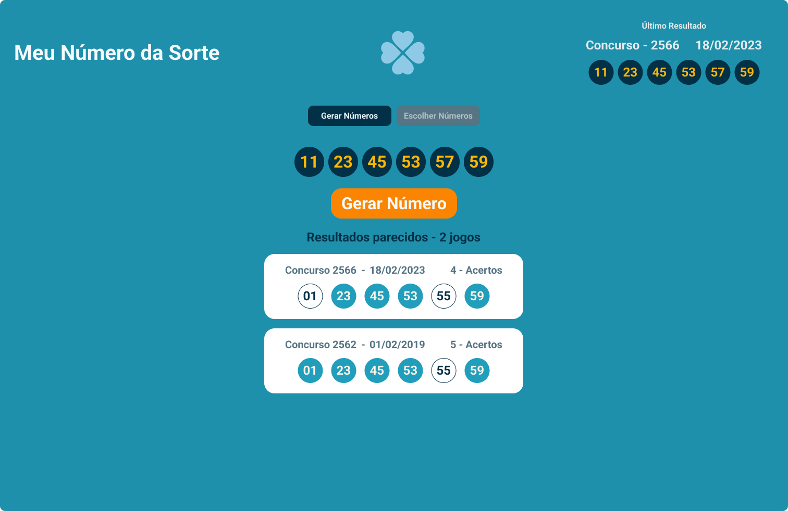

# Project Meu Número da Sorte (My Luck Number)

* [Introdunce](#Introdunce)
* [TheProject](#the-project)

## Introdunce

<p>The project genarates numbers to Mega sena prize draw seems the Mega Millions on EUA. There are analitycs the other results too  in project.</p>


### Create project in next
```bash
    npx create-next-app --typescript
```

## The Project

#### Formatter number and date

~~~javascript
    export const formatterNumber = () => ({
    addZero: (numero: number) => {
        if(numero.toString().length == 2) return numero.toString();

        return `0${numero}`;
    },
    formatterData: (data: string) => {

        const newData = Date.parse(data);

        const rightData = new Date(newData)

        const dia = rightData.getDate().toString().padStart(2, "0");
        const mes = (rightData.getMonth()+1).toString().padStart(2, "0");
        const ano = rightData.getFullYear();

        return `${dia}/${mes}/${ano}`;
    }
});
~~~

#### Function to generate randon number

~~~javascript
export const numeroDaSorte = () => ({

    randomNumber: () => {
        let numero = Math.floor(Math.random() * 61);
        for (let i = numero; i == 0; i = numero) {
            numero = Math.floor(Math.random() * 61)
        }
        return numero;
    }

});
~~~




<p align="center">Made with 💙 by Eduardo Duarte 👽</p>